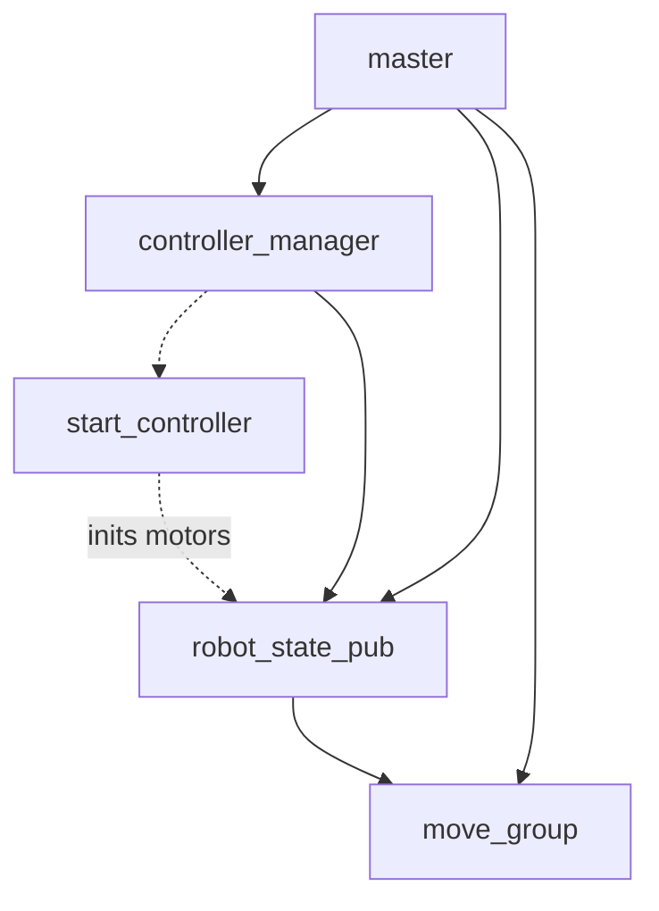

# running Handy on docker and docker-compose

Handy needs python2 to run because of the serial library that is used to talk with the dynamixel motors.
This forces kinetic (possibly melodic) as the primary ROS target, which makes it difficult to use modern tooling (think opencv or pytorch) in concert with the arm.
One solution that is currently employed by the lab is to network the handy code on a machine running Ubuntu 16/18, and to run modern code on another machine.
We can also use docker to encapsulate the ROS modules in the repo, so that the host machine can be on a more modern base system.

## quickstart

Ensure the current user is part of the `dialup` (for access to `/dev/ttyUSB0`) and `docker` groups.

```bash
sudo usermod -aG dialup $USER
sudo usermod -aG docker $USER
```

Logout and login for changes to take effect.
If you are runnning an older version of Ubuntu, you may have `docker` installed, but not `docker-compose`.
Install it via pip.

```bash
pip3 install docker-compose
```

Ensure that the site-packages bin directory is on your path.

At the root of the repository, run the following commands:

```bash
# build the images for the services
docker-compose build

# run the containers
docker-compose up
```

Now you are ready to run rviz.

```bash
roslaunch finalarm_moveit_config moveit_rviz.launch
```

## Dockerfile

The `Dockerfile` contains all the dependencies for the project.
The main steps are as follows:

- Installing build dependencies (gcc, git, etc)
- Configuring `rosdep`
- Adding dynamixel dependenices
- Initializing the catkin workspace
- Adding the handy repo to the catkin workspace
- Building all dependencies

We derive our Dockerfile from `ros:kinetic-ros-core-xenial`, which lets us set an environment that can be run on any machine.
We also need to configure a catkin workspace on the container, so we can install our external dependencies and the current repo.
We end up with the following directory structure under the `/app` folder.

```
/app
├── bin
├── build
├── devel
│   ├── include
│   ├── lib
│   └── share
└── src
    ├── ivaDynamixel
    └── ivaHandy
```

We create a `bin` directory that contains useful scripts in the context of our containerized process.
The first is `ros_entrypoint.sh`, which is a simple wrapper that activates `devel/setup.bash` and runs an arbitrary command e.g. `rostopic list`.
The second script is `wait_for_topic_pattern.sh`, which we use to ensure that dependencies are created appropriately when we bring up a series of containers.

## docker-compose

The `docker-compose.yml` contains the containers necessary for running Handy.
Refer to the README for the purpose of each stage.



We create a separate master node that runs `roscore` and handles IPC between the various nodes.
Each of the processes is put into their own network i.e. the controller manager, robot state publisher, and the moveit group.
Generally in docker compose, we set up an isolated network where containers communicate with each other via internal DNS.
However, resolving hostnames of each of the containers requires us to set various parameters e.g. `ROS_HOSTNAME` and `ROS_MASTER_URI`.
Instead, we simplify the configuration by assuming that we are using the host network.
This means that all of the containers can reach each other using `localhost`, but we also lose a degree of host (and cluster) isolation.

There are a few other sections to note, if you have never used docker compose before. When using a device, we need to explicitly declare it.

```yaml
    devices:
      - /dev/ttyUSB0
    privileged: true
```

Setting `devices` here is basically the equivalent as marking it as a volume using `priviledged` mode, but is the better way to expose access to the serial device.
We also set `priviledged` to true, otherwise we run into protocol errors (presumably because of permissions, but the logging information is sparse).

We also mount our local directory into the container:

```yaml
    volumes:
      - ./:/app/src/ivaHandy/
      - ./bin:/app/bin/
```

We can change our code, and simply restart our process.
This can save us from the long build process that's caused by dependency resolution.

There is also a dependency between the different ROS nodes.
We get around this by creating a script that will look for topic creation before moving on to the next stage.
We wrap this inside of a `bash -c` call, because our entrypoint will exec a single command.
If we try to use shell commands like `&&` or `||`, we'll run into strange issues.

```yaml
    command: |
      bash -c "
        bin/wait_for_topic_pattern.sh 'finalarm_position_controller_' &&
        stdbuf -o L roslaunch --wait finalarm_description robot_state_pub.launch
      "
```

The docker-compose configuration should be treated as a reference -- the same patterns can be used on other projects too.
There are some modifications that might need to be made, such as removing the master node (if we assume that a master node exists elsewhere) or passing in an explicit `ROS_MASTER_URI`.

Additionally, here are some handy commands to keep in mind:

```bash
# shell into a new instance of a service
docker-compose run --rm ${service} bash
# e.g.
docker-compose run --rm controller_manager bash

# show the logs for a specific container
docker-compose logs -f ${service}
# e.g.
docker-compose logs -f controller_manager
```

## resources

Here are some useful links:

- https://docs.docker.com/engine/install/linux-postinstall/
- https://docs.docker.com/compose/
- http://wiki.ros.org/docker/Tutorials/Compose
- https://hub.docker.com/_/ros